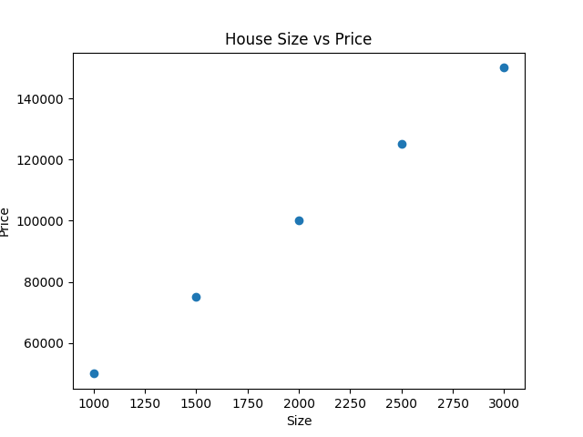

# 🏠 House Price Prediction using Python

A Python-based project that analyzes housing data and predicts house prices based on property features. The project demonstrates data analysis, visualization, and predictive techniques using Python.

---

## 🚀 Project Overview

House price prediction is an important application in the real estate industry. This project analyzes housing data to understand price trends and estimate property values based on various factors.

### Objectives

* Analyze housing datasets
* Visualize housing price trends
* Understand factors affecting house prices
* Demonstrate Python-based data analysis techniques

---

## 🛠️ Technologies Used

* Python
* Pandas
* NumPy
* Matplotlib

---

## 📂 Project Structure

```text
House-Price-Prediction-Python/
│
├── screenshots/
│   └── house_price_graph.png
│
├── house_price_prediction.py
├── house_prices.csv
├── House_Price_Report.pdf
├── House_Price_Report.docx
└── README.md
```

---

## 📊 Dataset Information

The dataset contains housing information such as:

* House Area
* Number of Bedrooms
* Number of Bathrooms
* Location
* House Price

These features are used to analyze and understand property pricing patterns.

---

## 📈 Results & Visualization

### House Price Analysis



**Observation:**
The graph illustrates house price variations across different properties and helps identify pricing patterns. Larger properties generally tend to have higher market values.

---

## 🔍 Key Insights

* House prices increase with property size.
* Property features significantly influence market value.
* Data visualization makes it easier to identify trends and patterns.
* Housing data can be used for predictive analysis and decision-making.

---

## 🎯 Results

✅ Successfully analyzed housing price data.

✅ Generated graphical visualizations using Matplotlib.

✅ Identified relationships between housing features and prices.

✅ Demonstrated practical implementation of Python for data analytics.

---

## ▶️ How to Run

```bash
git clone https://github.com/charanyadavkandhi/House-Price-Prediction-Python.git

cd House-Price-Prediction-Python

pip install pandas numpy matplotlib

python house_price_prediction.py
```

---

## 🔮 Future Enhancements

* Implement Machine Learning models for price prediction.
* Improve prediction accuracy using regression techniques.
* Build an interactive dashboard using Streamlit.
* Add support for larger real-estate datasets.

---

## 👨‍💻 Author

**Kandhi Charan Yadav**

🎓 B.Tech Computer Science Engineering, SR University

🔗 GitHub: https://github.com/charanyadavkandhi

🔗 LinkedIn: https://www.linkedin.com/in/kandhicharanyadav/

---

⭐ If you found this project useful, consider giving it a star.
